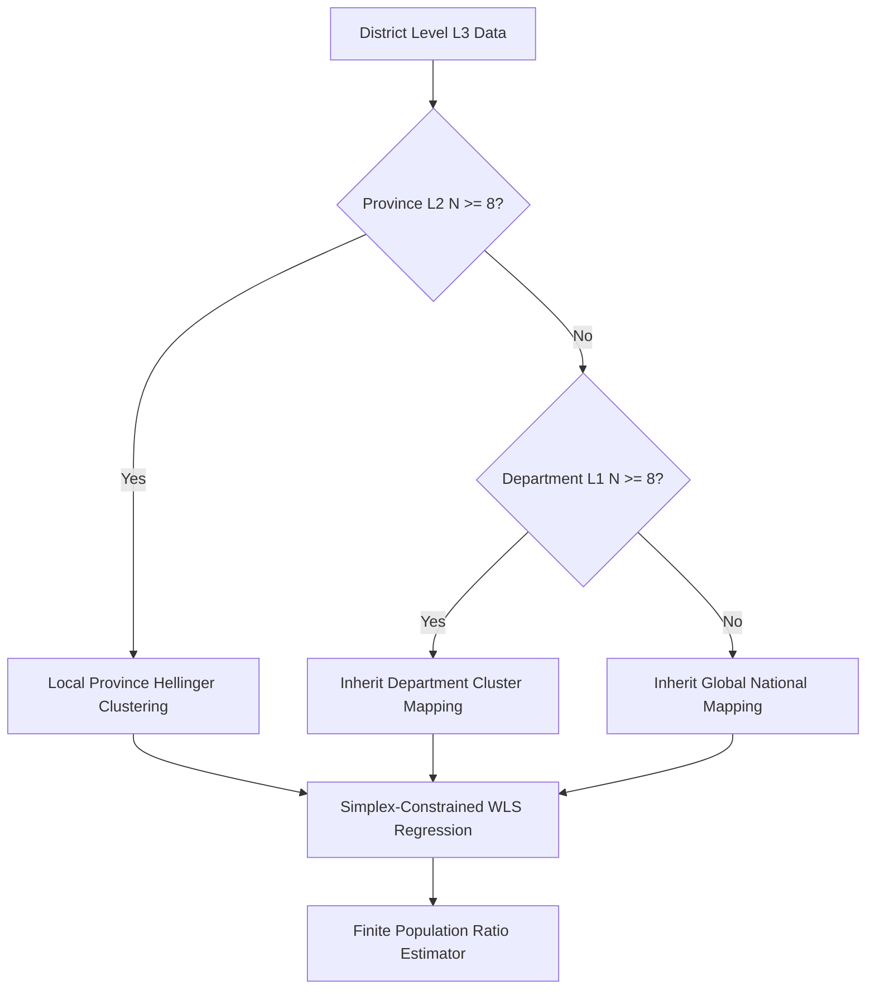

# SPECIFICATION DOCUMENT: ELECTION PROJECTION ENGINE
**Classification:** Statistical Design Matrix & Hierarchical Vote Migration Pipeline  
**Observation Level:** District ($L_3$)  
**Clustering Stratum:** Province ($L_2$)  

---

## 1. Architectural Overview

This document defines the mathematical and algorithmic architecture for processing multi-candidate first-round election data into a stabilized, low-dimensional design matrix, and subsequently modeling vote migration. The pipeline eliminates hyper-local noise by aggregating data to the **District level**, filters uninformative sparse features against **Total Emitted Votes**, groups collinear orphan candidates at the **Province level** using an information-theoretic distance metric, and applies simplex-constrained weighted regressions for final inference.

---

## 2. Mathematical Specifications

### Stage 1: Data Ingestion & Volume-Based Filtering
Let $d$ index an administrative district within province $p$. Let $V_{d, \text{emitted}}$ be the total votes cast in district $d$, and $E_d$ be the total eligible voters. The turnout ratio $\tau_d$ must satisfy physical boundary conditions:
$$0.10 \le \tau_d = \frac{V_{d, \text{emitted}}}{E_d} \le 1.00$$

Let $C_{\text{all}}$ be the set of all candidates. We isolate the runoff finalists $C_{\text{finalists}} = \{F_1, F_2\}$. The remaining candidates form the set of orphan candidates $C_{\text{orphans}}$, which explicitly includes **VOTOS EN BLANCO**.

To prevent sparse features from breaking downstream matrix inversions, we calculate a volume significance floor anchored to the total province turnout. A candidate enters the clustering pool for province $p$ if and only if:
$$\text{Significant Orphans}_p = \left\{ c \in C_{\text{orphans}} \mid \frac{\sum_{d \in p} v_{c, d}}{\sum_{d \in p} V_{d, \text{emitted}}} \ge 0.015 \right\}$$

All candidates falling below this $1.5\%$ threshold are collapsed into a single background deterministic feature: $G_{d, \text{Insignificant\_Tail}}$.

### Stage 2: Distributional Distance & Structural Clustering
For a province $p$ with $n_p$ reporting districts, we calculate the similarity between any two significant orphan candidates' support patterns using the **Hellinger Distance** ($D_H$). Let $P$ and $Q$ be the probability vectors representing the candidates' shares of the active orphan vote across the districts:
$$D_H(P, Q) = \frac{1}{\sqrt{2}} \sqrt{\sum_{d=1}^{n_p} \left(\sqrt{p_d} - \sqrt{q_d}\right)^2}$$

We execute an agglomerative hierarchical clustering routine using **Ward’s Minimum Variance Method** on the Hellinger distance matrix. To protect the model from overfitting and guarantee sufficient degrees of freedom ($df$) for downstream estimation, the number of generated clusters $k_p$ is dynamically constrained:
$$k_p = \min\left(\text{Active Significant Orphans}, \sqrt{n_p}, 6\right)$$

### Stage 3: Hierarchical Fallback Circuit
If a province has fewer than $T = 8$ reporting districts ($n_p < 8$), the local sample size is insufficient to compute a stable covariance matrix. The system triggers a recursive fallback to higher administrative strata to inherit group definitions:
$$\text{Specification Path: } \text{Province } (L_2) \longrightarrow \text{Department } (L_1) \longrightarrow \text{Global } (L_0)$$

### Stage 4: Constrained Vote Migration Modeling
Let $y_{d, R2}$ be the incoming real-time Round 2 vote count for a target finalist in district $d$. Using the consolidated design matrix from Stage 2, we execute a **Weighted Least Squares (WLS)** optimization to estimate the local transfer rates ($\boldsymbol{\beta}$):
$$\min_{\boldsymbol{\beta}} \sum_{d=1}^{n_p} w_d \left(y_{d, R2} - \left(\beta_{\text{base}} F_{d, R1} + \sum_{j=1}^{k_p} \beta_j G_{d, j} + \beta_{\text{tail}} G_{d, \text{Tail}} \right)\right)^2$$

This minimization is bound to a strict probability simplex to respect the **Conservation of Mass**:
$$0 \le \beta_x \le 1 \quad \forall \beta_x \quad \text{and} \quad \beta_{\text{base}} + \sum_{j=1}^{k_p} \beta_j + \beta_{\text{tail}} \le 1$$

The weight $w_d$ for each district scales inversely with the variance penalty of its clustering lineage, adjusting by the log of the total emitted votes to prevent small-district micro-variance distortion:
$$w_d = \psi_{\text{fallback\_level}} \cdot \log(V_{d, \text{emitted}})$$
Where $\psi_{\text{Province}} = 1.0$, $\psi_{\text{Department}} = 0.75$, and $\psi_{\text{Global}} = 0.40$.

### Stage 5: Population Ratio Estimation & Finite Population Variance
The final regional/national projection $\hat{P}$ for a finalist is solved using a finite-population ratio estimator combining observed district outcomes with predictions for unreported districts ($m$):
$$\hat{P} = \frac{\sum_{d \in \text{reported}} y_{d, R2} + \sum_{m \in \text{unreported}} \hat{y}_{m, R2}}{\sum_{d \in \text{reported}} V_{d, \text{total}} + \sum_{m \in \text{unreported}} V_{m, \text{total}}}$$

Because the total universe of districts ($N$) is fixed and known, the variance of the estimator incorporates the **Finite Population Correction (FPC)** factor:
$$Var(\hat{P}) \approx \left(1 - \frac{n}{N}\right) \frac{1}{n \bar{V}^2} \frac{\sum_{d=1}^n (y_d - \hat{P}V_d)^2}{n-1} + \sum_{m \in \text{unreported}} \sigma^2_{\text{pred}, m}$$

The dynamic confidence interval uses the Student's t-distribution based on the active degrees of freedom:
$$CI = \hat{P} \pm t_{\alpha/2, n-1} \sqrt{Var(\hat{P})}$$

---

## 3. Stat-Master Red Lines (Validation Constraints)

> 1. **Endogeneity Contamination:** Runoff finalists must be stripped from the data matrix *before* calculating any vote shares or Hellinger distances.
> 2. **Direct Imputation Bias:** When a province triggers a fallback, it must only inherit the candidate-to-cluster *mapping definitions* from the higher stratum. It must never inherit raw vote averages, which artificially destroys local variance.
> 3. **Constraint Violations (OLS Disallowance):** Unconstrained Ordinary Least Squares (OLS) must not be used for vote migration. If a regression allows $\sum \beta_x > 1.0$ or $\beta_x < 0$, it violates the probability simplex and must be mathematically rejected.
> 4. **Spatial Autocorrelation Errors:** Standard errors must not be reported using standard unadjusted OLS assumptions. Confidence intervals must employ **Huber-White Sandwich Estimators clustered at the Department level ($L_1$)** to handle spatial dependency across contiguous borders.
> 5. **Omission of the FPC:** Failing to apply the Finite Population Correction to a fixed-universe election model will result in artificially wide, stagnant confidence intervals that fail to converge as $n \to N$.