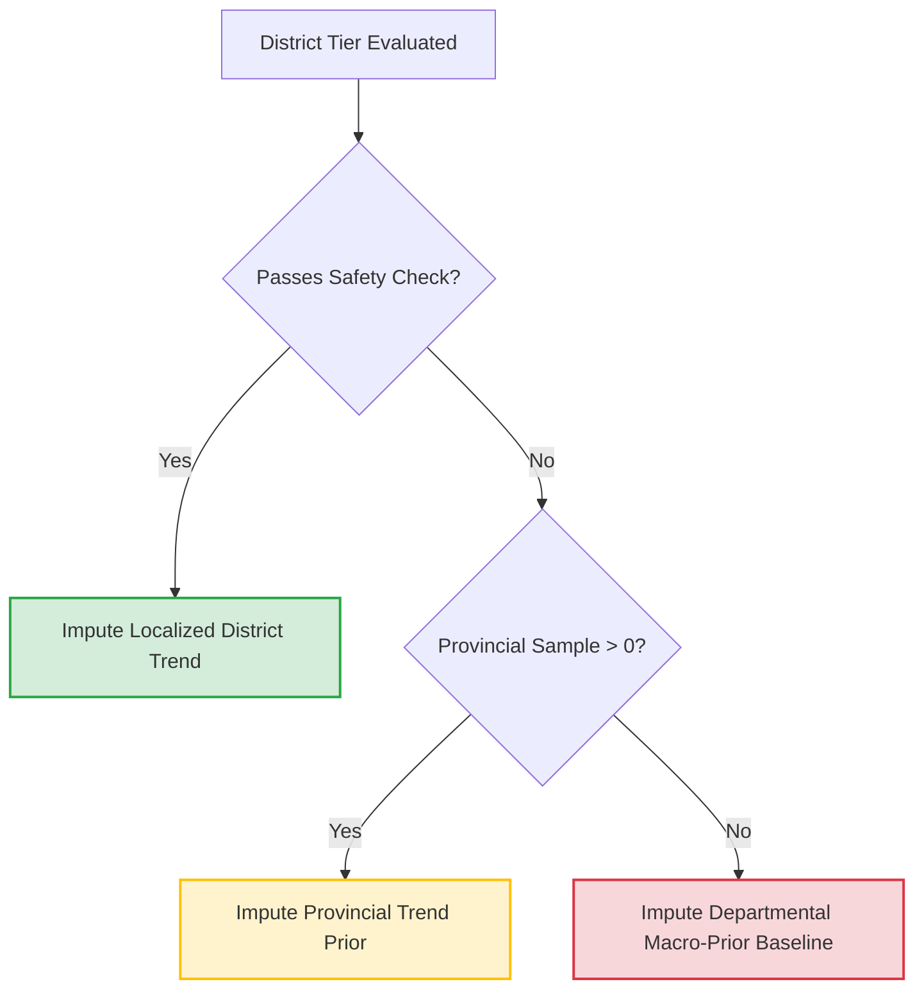

# 🗳️ Advanced Statistical Methodology: Dynamic Stratum Fallback & Variance Pooling

## 1. Overview
This documentation outlines the localized, adaptive estimation architecture used to handle highly uneven, real-time election reporting across asymmetric geographic levels. 

In real-time tracking, a rigid global stratification tier introduces catastrophic failures if a handful of remote or slow-counting districts report zero or near-zero tables. Rather than dropping precision globally, this engine implements **Dynamic Per-District Stratification Fallback**. Each district ($h$) is evaluated individually on its data maturity. If a district is flagged as unstable, the engine dynamically adapts its mathematical model, borrowing estimation priors from its parent macro-tier (Province or Department) while retaining its distinct structural population weight ($W_h$).

---

## 2. Dynamic Stability Rules
A district is evaluated row-by-row on election night to determine its structural stability. Let $n_h$ be the number of counted tables (acts) in district $h$, and $N_h$ be the total planned tables.

A stratum is classified as **Stable** if it satisfies at least one of the two following threshold criteria:

$$\text{Stability Condition: } \left( \frac{n_h}{N_h} \geq 0.50 \right) \lor \left( n_h \geq 14 \right)$$

* **Rule 1 (Reporting Density):** The district has processed $\geq 50\%$ of its total expected tables.
* **Rule 2 (Sample Adequacy):** The district has recorded a raw sample size of $\geq 14$ tables, satisfying asymptotic normal distribution properties regardless of percentage.

If a district fails **both** conditions, its localized trend data is rejected due to high volatility risk, and the engine initiates a localized structural fallback.

---

## 3. Adaptive Prior Imputation

### A. Resolution Footprint Hierarchy
The fallback path cascades sequentially through geographic tiers to resolve the valid turnout ratio ($R_{\text{valid}, h}$) and candidate distribution shares ($P_{\text{party}, h}$):

### B. Mathematical Adaptation Formula
The total projected votes for a political candidate ($\hat{V}_{\text{party}}$) updates dynamically using conditional parameter selection:

$$\hat{V}_{\text{party}} = V_{\text{observed}} + \sum_{h=1}^{L} \left( E_{\text{pending}, h} \times \tilde{R}_{\text{valid}, h} \times \tilde{P}_{\text{party}, h} \right)$$

Where the pending valid share parameters $\tilde{R}_{\text{valid}, h}$ and $\tilde{P}_{\text{party}, h}$ switch contexts based on local stability metadata:

$$\tilde{P}_{\text{party}, h} = 
\begin{cases} 
\frac{V_{\text{party}, h}}{V_{\text{valid}, h}}, & \text{if District } h \text{ is Stable and } V_{\text{valid}, h} > 0 \\ 
\frac{\sum_{i \in \text{Prov}} V_{\text{party}, i}}{\sum_{i \in \text{Prov}} V_{\text{valid}, i}}, & \text{if District } h \text{ is Unstable and Province has counted votes} \\
\frac{\sum_{j \in \text{Dept}} V_{\text{party}, j}}{\sum_{j \in \text{Dept}} V_{\text{valid}, j}}, & \text{if Province has no data}
\end{cases}$$

This structure guarantees that an uncounted district (e.g., $n_h = 0$) does not zero out pending projections. Instead, it securely extrapolates using its local eligible pending voter weight ($E_{\text{pending}, h}$) multiplied by the surrounding region's real-time political trend.

---

## 4. Resilient Variance Pooling & Degrees of Freedom
Mixing highly precise, stable districts with fallback macro-tiers inside a standard stratified variance equation introduces critical bugs. If a district has 0 or 1 tables reporting, Bessel's correction factor ($n_h - 1$) triggers a division-by-zero or produces negative variance terms. 

To address this, the engine implements a **Dynamic Variance Pooling** mechanism that matches sample sizes ($n_{\text{pooled}}$) to the resolved trend context.

### A. Modifying the Stratified Variance Equation
The adjusted national variance equations adapts dynamically across every individual stratum term:

$$Var(\hat{p}) = \sum_{h=1}^{L} W_h^2 \left( 1 - f_h \right) \frac{\tilde{p}_h(1 - \tilde{p}_h)}{n_{\text{pooled}, h} - 1}$$

Where the pooled degrees of freedom ($n_{\text{pooled}, h}$) are defined as:

$$n_{\text{pooled}, h} = 
\begin{cases} 
n_h, & \text{if District } h \text{ is Stable} \\
\sum_{i \in \text{Prov}} n_i, & \text{if District } h \text{ is Unstable and defaults to Province} \\
\sum_{j \in \text{Dept}} n_j, & \text{if District } h \text{ defaults to Department}
\end{cases}$$

### B. Statistical Implications of Pooling
1. **Resolution of the Asymptotic Bottleneck:** By replacing $n_h$ with the macro-tier sample size $\sum n_i$ for unstable rows, the denominator $n_{\text{pooled}, h} - 1$ is always safely locked $> 0$. The model completely avoids mathematical undefined states in uncounted areas.
2. **Finite Population Correction (FPC) Integrity:** The FPC term $\left(1 - f_h\right)$ continues to use the *district's* true reporting fraction ($n_h / N_h$). If an unstable district has 0 tables processed, its local FPC correctly equals $1$, allowing maximum uncertainty contribution. As tables are steadily counted, the local FPC shrinks normally, freezing the variance once execution hits $100\%$ precision.
3. **Cluster Correlation Mitigation:** Treating an unstable district as an independent sample with $n_h = 1$ would severely underestimate uncertainty. Substituting the pooled sample size of the parent macro-tier scales down the denominator, expanding the local variance boundary to accurately reflect that the district is currently dependent on a borrowed generalized trend.

---

## 5. Architectural Implementation Summary
The execution flow running within the processing matrix maps directly onto these updated statistical assumptions:

| Stratum Reporting State | Imputation Trend Prior ($\tilde{p}_h$) | Degree of Freedom ($n_{\text{pooled}}$) | FPC Reality ($1 - f_h$) | Impact on Margin of Error (MOE) |
| :--- | :--- | :--- | :--- | :--- |
| **Stable District** ($\geq 50\%$ or $\geq 14$ acts) | Hyper-local District Split | District count ($n_h$) | Shrinks dynamically | Margins contract tightly to match localized data certainty. |
| **Early District** ($>0$ acts but fails rules) | Provincial Aggregation | Province Total Count | High Variance | Margins expand slightly to absorb macro-tier trend bias. |
| **Zero-Data District** ($0$ acts counted) | Provincial / Dept Aggregation | Province / Dept Total Count | Maximum ($1.0$) | Variance is maximized, reflecting total historical/regional dependence. |